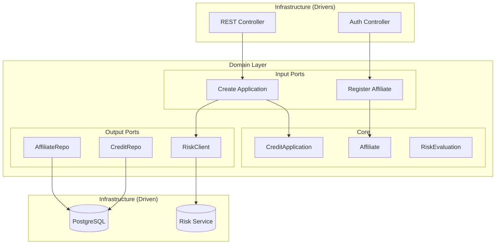
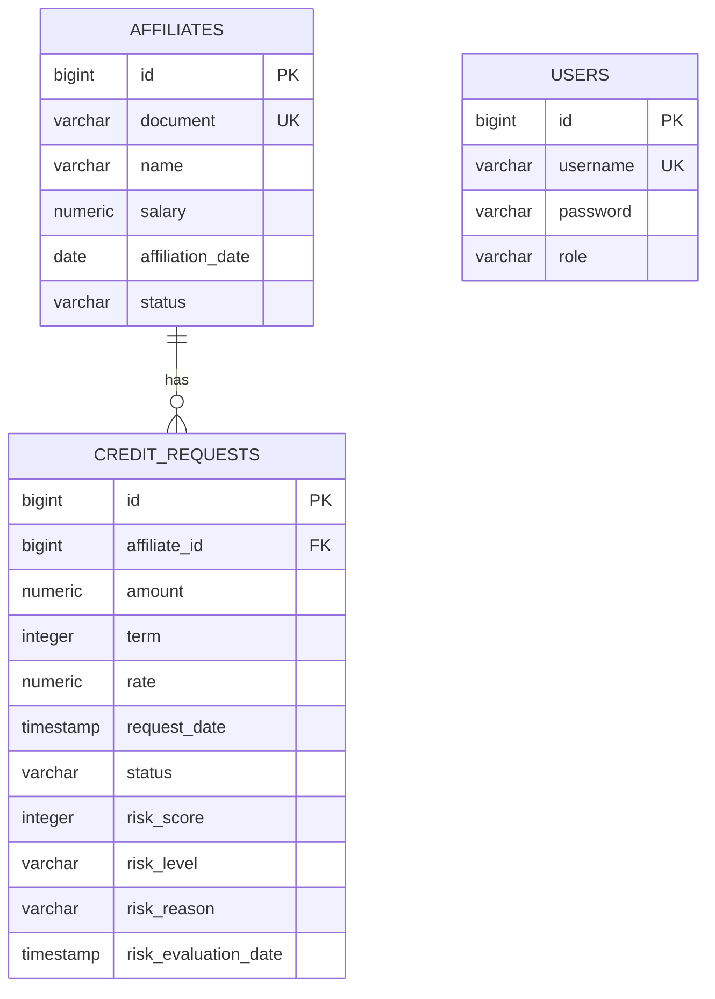

# 🏦 CoopCredit - Sistema Integral de Solicitudes de Crédito

[](https://www.oracle.com/java/)
[](https://spring.io/projects/spring-boot)
[](https://www.postgresql.org/)
[](https://www.docker.com/)
[](LICENSE)

Sistema empresarial para la gestión integral de solicitudes de crédito en cooperativas, implementado con **Arquitectura Hexagonal** y mejores prácticas de desarrollo.

---

## 📋 Tabla de Contenidos

- [Características](#-características)
- [Arquitectura](#-arquitectura)
- [Tecnologías](#-tecnologías)
- [Requisitos Previos](#-requisitos-previos)
- [Instalación y Configuración](#-instalación-y-configuración)
- [Uso](#-uso)
- [API Endpoints](#-api-endpoints)
- [Testing](#-testing)
- [Deployment](#-deployment)
- [Estructura del Proyecto](#-estructura-del-proyecto)
- [Contribución](#-contribución)

---

## ✨ Características

### Funcionalidades Principales

- 🔐 **Autenticación JWT** con roles diferenciados (Admin, Analista, Afiliado)
- 👥 **Gestión de Afiliados** con validaciones de negocio
- 💳 **Solicitudes de Crédito** con evaluación automatizada
- 📊 **Evaluación de Riesgo** mediante servicio externo
- 🔍 **Validaciones Avanzadas** con Bean Validation
- 📝 **Logging Estructurado** con TraceId para trazabilidad
- 📈 **Observabilidad** con Actuator y métricas Prometheus
- 🐘 **Migraciones Versionadas** con Flyway

### Reglas de Negocio

- ✅ Antigüedad mínima: 6 meses
- ✅ Monto máximo: 50x salario mensual
- ✅ Cuota máxima: 50% del ingreso mensual
- ✅ Evaluación de riesgo centralizada
- ✅ Aprobación automática según score de riesgo

---

## 🏗️ Arquitectura

### Arquitectura Hexagonal (Ports & Adapters)

```
┌─────────────────────────────────────────────────────────────┐
│                    INFRASTRUCTURE LAYER                      │
│  ┌──────────────────┐              ┌──────────────────┐     │
│  │  REST Controllers │              │  JPA Repositories │     │
│  │   (Input Port)   │              │   (Output Port)   │     │
│  └────────┬─────────┘              └─────────┬────────┘     │
│           │                                   │              │
│           │         ┌─────────────────┐      │              │
│           └────────►│ APPLICATION     │◄─────┘              │
│                     │  Use Cases      │                     │
│                     └────────┬────────┘                     │
│                              │                              │
│                     ┌────────▼────────┐                     │
│                     │   DOMAIN LAYER  │                     │
│                     │  (Pure Business) │                     │
│                     │  - Entities      │                     │
│                     │  - Value Objects │                     │
│                     │  - Domain Logic  │                     │
│                     └─────────────────┘                     │
└─────────────────────────────────────────────────────────────┘
```

### Diagrama de Componentes




---

## 🛠️ Tecnologías

### Backend
- **Java 17** - Lenguaje de programación
- **Spring Boot 3.5.8** - Framework principal
- **Spring Data JPA** - Persistencia
- **Spring Security** - Autenticación y autorización
- **JWT (jjwt)** - Tokens de autenticación
- **MapStruct** - Mapeo DTO ↔ Entity
- **Flyway** - Migraciones de base de datos

### Base de Datos
- **PostgreSQL 15** - Base de datos principal
- **H2** - Base de datos en memoria (tests)

### Observabilidad
- **Spring Boot Actuator** - Endpoints de monitoreo
- **Micrometer** - Métricas
- **Prometheus** - Formato de métricas
- **SLF4J/Logback** - Logging estructurado

### Testing
- **JUnit 5** - Framework de testing
- **Mockito** - Mocking
- **MockMvc** - Tests de integración
- **DataJpaTest** - Tests de repositorio

### DevOps
- **Docker** - Containerización
- **Docker Compose** - Orquestación
- **Maven** - Gestión de dependencias

---

## 📦 Requisitos Previos

- **Java 17+** ([Download](https://www.oracle.com/java/technologies/downloads/))
- **Maven 3.8+** ([Download](https://maven.apache.org/download.cgi))
- **Docker & Docker Compose** ([Download](https://www.docker.com/get-started))
- **PostgreSQL 15** (opcional para desarrollo local)

---

## 🚀 Instalación y Configuración

### Opción 1: Desarrollo Local con PostgreSQL en Docker

```bash
# 1. Clonar el repositorio
git clone https://github.com/tu-usuario/coopcredit.git
cd CoopCredit

# 2. Levantar PostgreSQL
docker-compose -f docker-compose.local.yml up -d

# 3. Compilar el proyecto
./mvnw clean install

# 4. Ejecutar la aplicación
./mvnw spring-boot:run
```

La aplicación estará disponible en: `http://localhost:8083`

**Swagger UI:** `http://localhost:8083/swagger-ui/index.html`

### Opción 2: Deployment Completo con Docker Compose

```bash
# 1. Clonar el repositorio
git clone https://github.com/tu-usuario/coopcredit.git
cd CoopCredit

# 2. Construir y levantar todos los servicios
docker-compose up --build

# 3. Verificar que todos los servicios estén saludables
docker-compose ps
```

**Servicios disponibles:**
- 🏦 **credit-application-service**: `http://localhost:8082`
- 📚 **Swagger UI**: `http://localhost:8082/swagger-ui/index.html`
- 🎲 **risk-central-mock-service**: `http://localhost:8081`
- 🐘 **PostgreSQL**: `localhost:5432`
- 🔥 **Prometheus**: `http://localhost:19090`
- 📊 **Grafana**: `http://localhost:3000` (User: `admin`, Pass: `admin123`)

---
## 🐘 Conexión con DBeaver (u otro cliente SQL)

Para visualizar la base de datos, configura tu cliente con estos datos:

| Campo | Valor | Nota |
|-------|-------|------|
| **Host** | `localhost` | |
| **Port** | `5433` | ⚠️ Cambiado de 5432 para evitar conflictos |
| **Database** | `coopcredit_db` | |
| **Username** | `postgres` | |
| **Password** | `Qwe.123*` | |
| **Driver** | PostgreSQL | |

---

## 💻 Uso

### 1. Autenticación

#### Registrar Usuario
```bash
curl -X POST http://localhost:8083/auth/register \
  -H "Content-Type: application/json" \
  -d '{
    "username": "usuario1",
    "password": "password123",
    "role": "ROLE_AFILIADO"
  }'
```

#### Login
```bash
curl -X POST http://localhost:8083/auth/login \
  -H "Content-Type: application/json" \
  -d '{
    "username": "admin",
    "password": "admin123"
  }'
```

**Respuesta:**
```json
{
  "token": "eyJhbGciOiJIUzI1NiIsInR5cCI6IkpXVCJ9..."
}
```

### 2. Gestión de Afiliados

#### Registrar Afiliado (requiere ROLE_ADMIN o ROLE_ANALISTA)
```bash
curl -X POST http://localhost:8083/affiliates \
  -H "Content-Type: application/json" \
  -H "Authorization: Bearer YOUR_JWT_TOKEN" \
  -d '{
    "document": "12345678",
    "name": "Juan Pérez",
    "salary": 5000.00
  }'
```

### 3. Solicitudes de Crédito

#### Crear Solicitud (requiere ROLE_AFILIADO)
```bash
curl -X POST http://localhost:8083/credit-requests \
  -H "Content-Type: application/json" \
  -H "Authorization: Bearer YOUR_JWT_TOKEN" \
  -d '{
    "affiliateId": 1,
    "amount": 10000.00,
    "term": 24
  }'
```

#### Evaluar Solicitud (requiere ROLE_ANALISTA)
```bash
curl -X POST http://localhost:8083/credit-requests/1/evaluate \
  -H "Authorization: Bearer YOUR_JWT_TOKEN"
```

### 4. Observabilidad

#### Health Check
```bash
curl http://localhost:8083/actuator/health
```

#### Métricas Prometheus
```bash
curl http://localhost:8083/actuator/prometheus
```

---

## 📡 API Endpoints

### 🔍 Explorar API con Swagger UI

La forma más fácil de explorar y probar la API es usando **Swagger UI**:

**URL:** `http://localhost:8083/swagger-ui.html`

Swagger UI proporciona:
- 📖 Documentación interactiva de todos los endpoints
- 🧪 Interfaz para probar requests directamente
- 🔐 Soporte para autenticación JWT
- 📝 Esquemas de request/response

### Autenticación
| Método | Endpoint | Descripción | Auth |
|--------|----------|-------------|------|
| POST | `/auth/register` | Registrar usuario | ❌ |
| POST | `/auth/login` | Iniciar sesión | ❌ |

### Afiliados
| Método | Endpoint | Descripción | Roles |
|--------|----------|-------------|-------|
| POST | `/affiliates` | Registrar afiliado | ADMIN, ANALISTA |
| PUT | `/affiliates/{id}` | Editar afiliado | ADMIN |

### Solicitudes de Crédito
| Método | Endpoint | Descripción | Roles |
|--------|----------|-------------|-------|
| POST | `/credit-requests` | Crear solicitud | AFILIADO |
| POST | `/credit-requests/{id}/evaluate` | Evaluar solicitud | ANALISTA |

### Actuator
| Método | Endpoint | Descripción |
|--------|----------|-------------|
| GET | `/actuator/health` | Estado de salud |
| GET | `/actuator/info` | Información de la app |
| GET | `/actuator/prometheus` | Métricas Prometheus |

---

## 🧪 Testing

### Ejecutar Todos los Tests
```bash
./mvnw test
```

### Ejecutar Tests Específicos
```bash
# Unit Tests
./mvnw test -Dtest=EvaluateCreditRequestUseCaseImplTest

# Integration Tests
./mvnw test -Dtest=AffiliateControllerTest

# Repository Tests
./mvnw test -Dtest=SpringDataAffiliateRepositoryTest
```

### Cobertura de Tests
- ✅ **Unit Tests**: Casos de uso con Mockito
- ✅ **Integration Tests**: Controllers con MockMvc
- ✅ **Repository Tests**: JPA con H2

**Resultado esperado:** `Tests run: 7, Failures: 0, Errors: 0, Skipped: 0`

---

## 🐳 Deployment

### Variables de Entorno

#### Aplicación Principal
```env
SERVER_PORT=8082
SPRING_DATASOURCE_URL=jdbc:postgresql://postgres:5432/coopcredit_db
SPRING_DATASOURCE_USERNAME=postgres
SPRING_DATASOURCE_PASSWORD=postgres
SPRING_JPA_HIBERNATE_DDL_AUTO=validate
SPRING_FLYWAY_ENABLED=true
RISK_CENTRAL_URL=http://risk-central-mock-service:8081
```

#### Risk Mock Service
```env
SERVER_PORT=8081
```

### Docker Compose

```bash
# Levantar servicios
docker-compose up -d

# Ver logs
docker-compose logs -f credit-application-service

# Detener servicios
docker-compose down

# Limpiar volúmenes
docker-compose down -v
```

---

## 📁 Estructura del Proyecto

```
CoopCredit/
├── src/
│   ├── main/
│   │   ├── java/com/codeup/coopcredit/
│   │   │   ├── domain/                    # Capa de dominio (pura)
│   │   │   │   ├── model/
│   │   │   │   │   ├── affiliate/
│   │   │   │   │   └── creditrequest/
│   │   │   │   └── ports/
│   │   │   │       ├── in/               # Puertos de entrada
│   │   │   │       └── out/              # Puertos de salida
│   │   │   ├── application/              # Casos de uso
│   │   │   │   └── usecase/
│   │   │   └── infrastructure/           # Adaptadores
│   │   │       ├── adapter/
│   │   │       │   ├── input/rest/       # Controllers REST
│   │   │       │   └── output/
│   │   │       │       ├── persistence/  # Adaptadores JPA
│   │   │       │       └── external/     # Servicios externos
│   │   │       └── config/               # Configuración
│   │   └── resources/
│   │       ├── db/migration/             # Scripts Flyway
│   │       │   ├── V1__init_schema.sql
│   │       │   └── V2__seed_data.sql
│   │       └── application.properties
│   └── test/                             # Tests
├── risk-central-mock-service/            # Microservicio mock
├── docker-compose.yml                    # Orquestación completa
├── docker-compose.local.yml              # Solo PostgreSQL
├── Dockerfile                            # Imagen de la app
├── pom.xml                               # Dependencias Maven
└── README.md
```

---

## 🔒 Seguridad

### Usuarios por Defecto (Seed Data)

| Usuario | Password | Rol |
|---------|----------|-----|
| `admin` | `admin123` | ROLE_ADMIN |
| `analyst` | `analyst123` | ROLE_ANALISTA |

⚠️ **IMPORTANTE**: Cambiar estas credenciales en producción.

### JWT Configuration

- **Secret Key**: Configurada en `JwtService`
- **Expiración**: 24 horas
- **Algoritmo**: HS256

---

## 📊 Base de Datos

### Migraciones Flyway

#### V1__init_schema.sql
- Tabla `affiliates`
- Tabla `credit_requests`
- Tabla `users`
- Índices y constraints

#### V2__seed_data.sql
- Usuarios admin y analyst
- 3 afiliados de ejemplo

### Diagrama ER



---

## 🤝 Contribución

Las contribuciones son bienvenidas. Por favor:

1. Fork el proyecto
2. Crea una rama para tu feature (`git checkout -b feature/AmazingFeature`)
3. Commit tus cambios (`git commit -m 'Add some AmazingFeature'`)
4. Push a la rama (`git push origin feature/AmazingFeature`)
5. Abre un Pull Request

---

## 📝 Licencia

Este proyecto está bajo la Licencia MIT. Ver el archivo `LICENSE` para más detalles.

---

## 👥 Autores

- **Tu Nombre** - *Desarrollo Inicial* - [GitHub](https://github.com/tu-usuario)

---

## 🙏 Agradecimientos

- Spring Boot Team
- Arquitectura Hexagonal por Alistair Cockburn
- Comunidad de desarrolladores Java

---

## 📞 Soporte

Para preguntas o soporte:
- 📧 Email: soporte@coopcredit.com
- 🐛 Issues: [GitHub Issues](https://github.com/tu-usuario/coopcredit/issues)
- 📖 Documentación: [Wiki](https://github.com/tu-usuario/coopcredit/wiki)

---

**Desarrollado con ❤️ usando Arquitectura Hexagonal**
