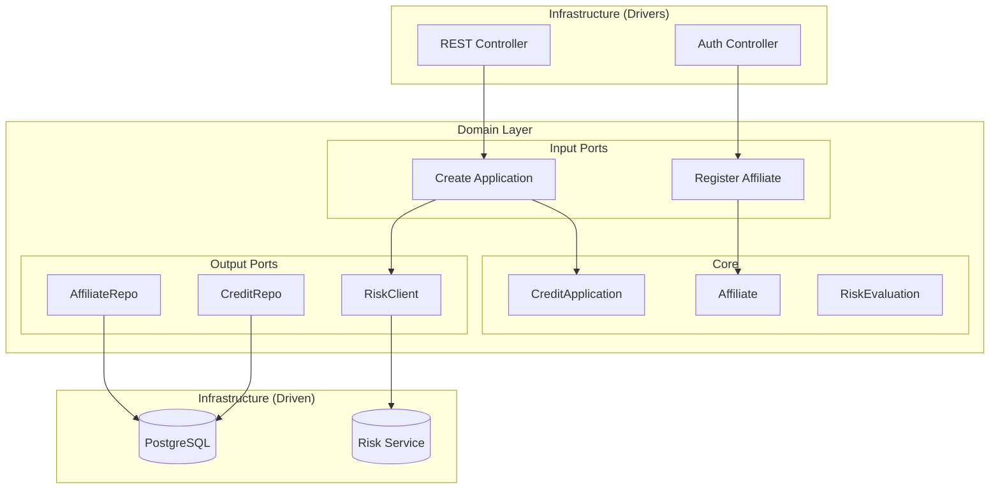
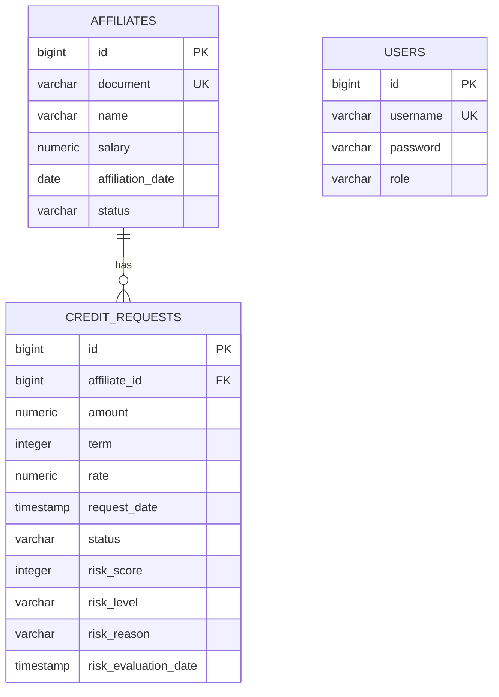

# CoopCredit - Comprehensive Credit Application System

[](https://www.oracle.com/java/)
[](https://spring.io/projects/spring-boot)
[](https://www.postgresql.org/)
[](https://www.docker.com/)
[](LICENSE)

Enterprise-grade system for comprehensive credit application management in cooperatives, implemented with **Hexagonal Architecture** and industry best practices.

---

## Table of Contents

- [Features](#features)
- [Architecture](#architecture)
- [Technologies](#technologies)
- [Prerequisites](#prerequisites)
- [Installation and Configuration](#installation-and-configuration)
- [Usage](#usage)
- [API Endpoints](#api-endpoints)
- [Testing](#testing)
- [Deployment](#deployment)
- [Project Structure](#project-structure)
- [Contributing](#contributing)
- [License](#license)

---

## Features

### Core Functionalities

- **JWT Authentication** with role-based access control (Admin, Analyst, Affiliate)
- **Affiliate Management** with comprehensive business validations
- **Credit Application Processing** with automated evaluation workflows
- **Risk Assessment Integration** via external service
- **Advanced Input Validations** using Bean Validation framework
- **Structured Logging** with TraceId for distributed tracing
- **Observability & Monitoring** with Spring Boot Actuator and Prometheus metrics
- **Database Version Control** with Flyway migrations

### Business Rules

- Minimum affiliation period: 6 months
- Maximum credit amount: 50x monthly salary
- Maximum installment: 50% of monthly income
- Centralized risk assessment
- Automated approval based on risk score

---

## Architecture

### Hexagonal Architecture (Ports & Adapters)

```
┌─────────────────────────────────────────────────────────────┐
│                    INFRASTRUCTURE LAYER                      │
│  ┌──────────────────┐              ┌──────────────────┐     │
│  │  REST Controllers │              │  JPA Repositories │     │
│  │   (Input Port)   │              │   (Output Port)   │     │
│  └────────┬─────────┘              └─────────┬────────┘     │
│           │                                   │              │
│           │         ┌─────────────────┐      │              │
│           └────────►│ APPLICATION     │◄─────┘              │
│                     │  Use Cases      │                     │
│                     └────────┬────────┘                     │
│                              │                              │
│                     ┌────────▼────────┐                     │
│                     │   DOMAIN LAYER  │                     │
│                     │  (Pure Business) │                     │
│                     │  - Entities      │                     │
│                     │  - Value Objects │                     │
│                     │  - Domain Logic  │                     │
│                     └─────────────────┘                     │
└─────────────────────────────────────────────────────────────┘
```

### Component Diagram



---

## Technologies

### Backend Stack
- **Java 17** - Programming language
- **Spring Boot 3.5.8** - Application framework
- **Spring Data JPA** - Data persistence layer
- **Spring Security** - Authentication and authorization
- **JWT (jjwt)** - Stateless authentication tokens
- **MapStruct** - DTO to Entity mapping
- **Flyway** - Database migration management

### Database
- **PostgreSQL 15** - Primary relational database
- **H2** - In-memory database for testing

### Observability
- **Spring Boot Actuator** - Application monitoring endpoints
- **Micrometer** - Application metrics instrumentation
- **Prometheus** - Metrics collection and storage
- **SLF4J/Logback** - Structured logging framework

### Testing
- **JUnit 5** - Unit testing framework
- **Mockito** - Mocking framework
- **MockMvc** - REST API integration testing
- **DataJpaTest** - Repository layer testing

### DevOps
- **Docker** - Application containerization
- **Docker Compose** - Multi-container orchestration
- **Maven** - Build automation and dependency management

---

## Prerequisites

- **Java 17+** ([Download](https://www.oracle.com/java/technologies/downloads/))
- **Maven 3.8+** ([Download](https://maven.apache.org/download.cgi))
- **Docker & Docker Compose** ([Download](https://www.docker.com/get-started))
- **PostgreSQL 15** (optional for local development)

---

## Installation and Configuration

### Option 1: Local Development with PostgreSQL in Docker

```bash
# 1. Clone the repository
git clone https://github.com/your-username/coopcredit.git
cd CoopCredit

# 2. Start PostgreSQL
docker-compose -f docker-compose.local.yml up -d

# 3. Build the project
./mvnw clean install

# 4. Run the application
./mvnw spring-boot:run
```

The application will be available at: `http://localhost:8082`

**Swagger UI:** `http://localhost:8082/swagger-ui/index.html`

### Option 2: Complete Deployment with Docker Compose

```bash
# 1. Clone the repository
git clone https://github.com/your-username/coopcredit.git
cd CoopCredit

# 2. Build and start all services
docker-compose up --build

# 3. Verify that all services are healthy
docker-compose ps
```

**Available Services:**
- **credit-application-service**: `http://localhost:8082`
- **Swagger UI**: `http://localhost:8082/swagger-ui/index.html`
- **risk-central-mock-service**: `http://localhost:8081`
- **PostgreSQL**: `localhost:5434`
- **Prometheus**: `http://localhost:9091`
- **Grafana**: `http://localhost:3000` (User: `admin`, Pass: `admin123`)

---

## Database Connection (DBeaver or SQL Client)

To connect to the database using a SQL client, use the following configuration:

| Field | Value | Note |
|-------|-------|------|
| **Host** | `localhost` | |
| **Port** | `5434` | Changed from 5432 to avoid conflicts |
| **Database** | `coopcredit_db` | |
| **Username** | `postgres` | |
| **Password** | `Qwe.123*` | |
| **Driver** | PostgreSQL | |

---

## Usage

### 1. Authentication

#### Register User
```bash
curl -X POST http://localhost:8082/auth/register \
  -H "Content-Type: application/json" \
  -d '{
    "username": "user1",
    "password": "password123",
    "role": "ROLE_AFILIADO"
  }'
```

#### Login
```bash
curl -X POST http://localhost:8082/auth/login \
  -H "Content-Type: application/json" \
  -d '{
    "username": "admin",
    "password": "admin123"
  }'
```

**Response:**
```json
{
  "token": "eyJhbGciOiJIUzI1NiIsInR5cCI6IkpXVCJ9..."
}
```

### 2. Affiliate Management

#### Register Affiliate (requires ROLE_ADMIN or ROLE_ANALISTA)
```bash
curl -X POST http://localhost:8082/affiliates \
  -H "Content-Type: application/json" \
  -H "Authorization: Bearer YOUR_JWT_TOKEN" \
  -d '{
    "document": "12345678",
    "name": "John Doe",
    "salary": 5000.00
  }'
```

### 3. Credit Applications

#### Create Application (requires ROLE_AFILIADO)
```bash
curl -X POST http://localhost:8082/credit-requests \
  -H "Content-Type: application/json" \
  -H "Authorization: Bearer YOUR_JWT_TOKEN" \
  -d '{
    "affiliateId": 1,
    "amount": 10000.00,
    "term": 24
  }'
```

#### Evaluate Application (requires ROLE_ANALISTA)
```bash
curl -X POST http://localhost:8082/credit-requests/1/evaluate \
  -H "Authorization: Bearer YOUR_JWT_TOKEN"
```

### 4. Observability

#### Health Check
```bash
curl http://localhost:8082/actuator/health
```

#### Prometheus Metrics
```bash
curl http://localhost:8082/actuator/prometheus
```

---

## API Endpoints

### Explore API with Swagger UI

The easiest way to explore and test the API is using **Swagger UI**:

**URL:** `http://localhost:8082/swagger-ui.html`

Swagger UI provides:
- Interactive documentation of all endpoints
- Interface to test requests directly
- JWT authentication support
- Request/response schemas

### Authentication Endpoints
| Method | Endpoint | Description | Auth Required |
|--------|----------|-------------|---------------|
| POST | `/auth/register` | Register new user | No |
| POST | `/auth/login` | Authenticate user | No |

### Affiliate Endpoints
| Method | Endpoint | Description | Required Roles |
|--------|----------|-------------|----------------|
| POST | `/affiliates` | Register affiliate | ADMIN, ANALISTA |
| PUT | `/affiliates/{id}` | Update affiliate | ADMIN |

### Credit Application Endpoints
| Method | Endpoint | Description | Required Roles |
|--------|----------|-------------|----------------|
| POST | `/credit-requests` | Create application | AFILIADO |
| POST | `/credit-requests/{id}/evaluate` | Evaluate application | ANALISTA |

### Actuator Endpoints
| Method | Endpoint | Description |
|--------|----------|-------------|
| GET | `/actuator/health` | Application health status |
| GET | `/actuator/info` | Application information |
| GET | `/actuator/prometheus` | Prometheus metrics |

---

## Testing

### Run All Tests
```bash
./mvnw test
```

### Run Specific Tests
```bash
# Unit Tests
./mvnw test -Dtest=EvaluateCreditRequestUseCaseImplTest

# Integration Tests
./mvnw test -Dtest=AffiliateControllerTest

# Repository Tests
./mvnw test -Dtest=SpringDataAffiliateRepositoryTest
```

### Test Coverage
- **Unit Tests**: Use case implementations with Mockito
- **Integration Tests**: REST controllers with MockMvc
- **Repository Tests**: JPA repositories with H2

**Expected result:** `Tests run: 7, Failures: 0, Errors: 0, Skipped: 0`

---

## Deployment

### Environment Variables

#### Main Application
```env
SERVER_PORT=8082
SPRING_DATASOURCE_URL=jdbc:postgresql://postgres:5432/coopcredit_db
SPRING_DATASOURCE_USERNAME=postgres
SPRING_DATASOURCE_PASSWORD=postgres
SPRING_JPA_HIBERNATE_DDL_AUTO=validate
SPRING_FLYWAY_ENABLED=true
RISK_CENTRAL_URL=http://risk-central-mock-service:8081
```

#### Risk Mock Service
```env
SERVER_PORT=8081
```

### Docker Compose Commands

```bash
# Start services
docker-compose up -d

# View logs
docker-compose logs -f credit-application-service

# Stop services
docker-compose down

# Clean volumes
docker-compose down -v
```

---

## Project Structure

```
CoopCredit/
├── src/
│   ├── main/
│   │   ├── java/com/codeup/coopcredit/
│   │   │   ├── domain/                    # Domain layer (pure business logic)
│   │   │   │   ├── model/
│   │   │   │   │   ├── affiliate/
│   │   │   │   │   └── creditrequest/
│   │   │   │   └── ports/
│   │   │   │       ├── in/               # Input ports (use cases)
│   │   │   │       └── out/              # Output ports (repositories)
│   │   │   ├── application/              # Application layer (use case implementations)
│   │   │   │   └── usecase/
│   │   │   └── infrastructure/           # Infrastructure layer (adapters)
│   │   │       ├── adapter/
│   │   │       │   ├── input/rest/       # REST Controllers
│   │   │       │   └── output/
│   │   │       │       ├── persistence/  # JPA Adapters
│   │   │       │       └── external/     # External services
│   │   │       └── config/               # Configuration
│   │   └── resources/
│   │       ├── db/migration/             # Flyway migration scripts
│   │       │   ├── V1__init_schema.sql
│   │       │   └── V2__seed_data.sql
│   │       └── application.properties
│   └── test/                             # Test suite
├── risk-central-mock-service/            # Mock microservice
├── docker-compose.yml                    # Complete orchestration
├── docker-compose.local.yml              # PostgreSQL only
├── Dockerfile                            # Application image
├── pom.xml                               # Maven dependencies
└── README.md
```

---

## Security

### Default Users (Seed Data)

| Username | Password | Role |
|----------|----------|------|
| `admin` | `admin123` | ROLE_ADMIN |
| `analyst` | `analyst123` | ROLE_ANALISTA |

**IMPORTANT:** Change these credentials in production environments.

### JWT Configuration

- **Secret Key**: Configured in `JwtService`
- **Token Expiration**: 24 hours
- **Algorithm**: HS256

---

## Database

### Flyway Migrations

#### V1__init_schema.sql
- Table `affiliates`
- Table `credit_requests`
- Table `users`
- Indexes and constraints

#### V2__seed_data.sql
- Admin and analyst users
- 3 sample affiliates

### Entity Relationship Diagram



---

## Contributing

Contributions are welcome. Please follow these guidelines:

1. Fork the project
2. Create a feature branch (`git checkout -b feature/AmazingFeature`)
3. Commit your changes (`git commit -m 'Add some AmazingFeature'`)
4. Push to the branch (`git push origin feature/AmazingFeature`)
5. Open a Pull Request

---

## License

This project is licensed under the MIT License. See the `LICENSE` file for details.

---

## Authors

- **Your Name** - *Initial Development* - [GitHub](https://github.com/your-username)

---

## Acknowledgments

- Spring Boot Team
- Hexagonal Architecture by Alistair Cockburn
- Java developer community

---

## Support

For questions or support:
- **Email**: support@coopcredit.com
- **Issues**: [GitHub Issues](https://github.com/your-username/coopcredit/issues)
- **Documentation**: [Wiki](https://github.com/your-username/coopcredit/wiki)

---

**Developed with Hexagonal Architecture principles**

